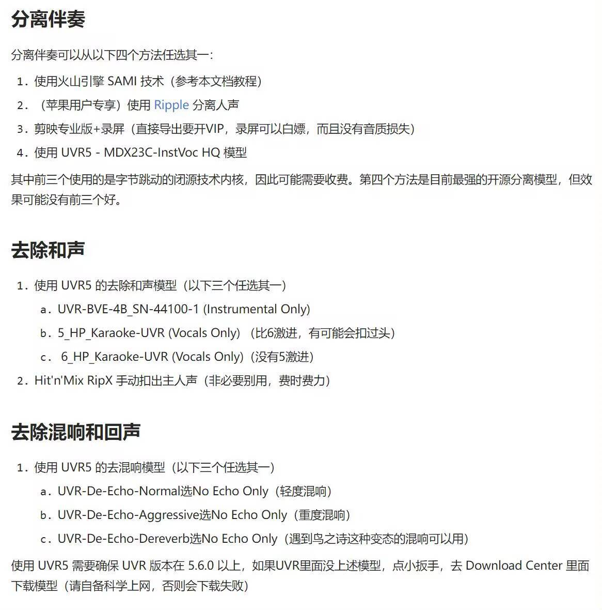

# 介绍
AutoMinceSlicer是通过歌声的标注文件TextGrid来进行人力音源切片的脚本。  
对歌声的标注环节基本照搬了[Diffsinger数据预处理和数据集制作](https://openvpi-docs.feishu.cn/wiki/KjXVwPqEoi3aNRkNIazciLgjn6e)的流程  
整体来说，准确率还是比较高的，切出来的大部分都能用，效果可参考[自动切臊子测试](https://www.bilibili.com/video/BV16t421j7Ps/)  
**说明**：没有一键包，需要花费精力进行配置，有看不懂的地方可以去看参考文档  
## 文件目录说明
- LyricFA(LyricFA的修改文件)
	- JpG2p.py
	- match_lyric_jp.py
	- rapid_asr_jp.py
- AutoMinceSlicer(音源切片脚本)
	- minceSlicer.py(脚本源码)
	- minceSlicer.exe(可执行文件)
	
相关项目地址：  
[wolfgitpr/LyricFA (github.com)](https://github.com/wolfgitpr/LyricFA)  
[openvpi/dataset-tools: DiffSinger dataset processing tools, including audio processing, labeling. (github.com)](https://github.com/openvpi/dataset-tools)  
[qiuqiao/SOFA: SOFA: Singing-Oriented Forced Aligner (github.com)](https://github.com/qiuqiao/SOFA)  
# 0. 提取干声
请参照网上教程自主学习  
我常用的流程是`UVR5 - MDX23C - InstVoc HQ -> 5_HP_Karaoke-UVR ->UVR-De-Echo-Normal`
  
# 1. 对音频进行切片
首先需要将干声变成几秒或者十几秒的切片，使用AudioSlicer进行  
**参考文档：[data-set tool使用文档](https://openvpi-docs.feishu.cn/wiki/MarkwXLYYiKR3SkJwSMcWALlnJh)**  
请依照参考文档的AudioSlicer进行。
## 1.1 data-set tool的下载安装
从这里下载[Releases · openvpi/dataset-tools (github.com)](https://github.com/openvpi/dataset-tools/releases)  
  
## 1.2 AudioSlicer的使用
解压后，双击AudioSlicer.exe打开  
  
左上：添加音频文件  
右侧：设置导出目录  
右下：开始  
  
右侧方框参数说明（一般用默认的就行了）：
`Threshold（dB）`：以 dB 表示的 RMS 阈值。所有 RMS 值都低于此阈值的区域将被视为静音。如果音频有噪音，请增加此值。默认值为 -40。​  
`Minimum Length（ms）`：每个切片的最小长度，以毫秒为单位。默认值为 5000。​  
`Minimum Interval（ms）`：要切片的静音部分的最小长度，以毫秒为单位。如果音频仅包含短暂的中断，请将此值设置得更小。此值越小，应用生成的切片音频剪辑可能就越多。请注意，此值必须小于 min_length 且大于 hop_size。默认值为 300。​  
`Hop Size`：每个 RMS 帧的长度，以毫秒为单位。增加此值将提高切片的精度，但会减慢该过程。默认值为 10。​  
`Maximum Slience Length（ms）`：在切片音频周围保持的最大静音长度，以毫秒为单位显示。根据需要调整此值。​  
请注意，设置此值并不意味着切片音频中的静音部分具有完全给定的长度。如上所述，该算法将搜索要切片的最佳位置。默认值为 1000。​  
`Output Directory`：该选项为选定输出文件夹，请点击Browse点击并选择你的导出文件夹，留空则输出到源文件的位置。（强烈建议导出到其他⽂件夹以防止数据混淆）
`Slicing Mode`：
- Save audio chunks only 直接输出切片后的音频  
- Save audio chunks only (load markers) 根据标记文件输出切片后的音频​  
- Save markers only 只输出标记文件​  
- Save audio chunks and markers 同时输出切片音频和标记文件

# 2. 使用Minable进行标注
**参考文档：[data-set tool使用文档 - 飞书云文档 (feishu.cn)](https://openvpi-docs.feishu.cn/wiki/MarkwXLYYiKR3SkJwSMcWALlnJh)**  
请参考文档的Minable进行
可参考本文的`5. (可选)使用LyricFA基于歌词对切片音频进行自动标注`来减轻手标工作量
  
点击左上角的`File`->`Open Folder`,选择刚刚通过AudioSlicer切片完的音频存放路径
  
在日语流程中，请用**罗马音**进行标注。将右侧红框处切换为`romaji`，从左侧选择音频进行标注，在红框栏中输入这段音频对应的罗马音，然后按下`Replace`。  
如果没有声音请点击耳机形状的按钮切换音频输出设备  
被标注过的音频名字会如图中一般变灰  
默认设置下，标注文件会生成在切片音频文件夹内，可以通过`File` -> `Out Directory`修改导出文件夹
所有音频全部变灰后标注完成  
  

# 3. 使用SOFA对齐音频并生成textgrid标记
>SOFA (Singing-Oriented Forced Aligner)是一个专为歌声设计的强制对齐器，同时也兼容非歌声的对齐。相比于MFA更加准确，更易部署。也更适配拼接声库转制​
>实测在lab准确的情况下SOFA对齐不比精标差多少 

参考文档：[SOFA使用文档 - 飞书云文档 (feishu.cn)](https://openvpi-docs.feishu.cn/wiki/EWkawdcYjii9rlkEu1GcQyaNnAg)    
参考文档进行安装和使用  
## 3.1 Anaconda的下载和安装
接下来的流程都在Anaconda中进行，如已安装可跳过  
点击链接下载[Distribution | Anaconda](https://www.anaconda.com/download/)   
如遇到需要登录，可点击下方的Skip registration跳过
  
选择Windows
  
选择Just Me
  
选择安装路径
  
一定要勾上Add PATH
  
# 3.2 使用Anaconda创建虚拟环境
打开Anaconda Powershell Prompt，输入以下命令，创建一个名为SOFA的Python 3.8虚拟环境。（SOFA也可以改成其他的名字，以下皆用SOFA）
```python
conda create -n SOFA python=3.8 -y
```
激活环境
```python
conda activate SOFA
```
访问[PyTorch官网](https://pytorch.org/get-started/locally/)，根据您的操作系统和硬件，按照官方说明复制代码安装PyTorch​  
  
## 3.3 下载SOFA库并准备依赖
项目地址：[qiuqiao/SOFA: SOFA: Singing-Oriented Forced Aligner (github.com)](https://github.com/qiuqiao/SOFA)  
若不会使用git，可以如图所示下载压缩包然后解压。
  
在终端中使用cd命令进入你的SOFA仓库地址
```python
cd path/to/your/SOFA
```
安装依赖
```python
pip install -r requirements.txt -i https://pypi.tuna.tsinghua.edu.cn/simple
```
从[这里](https://github.com/qiuqiao/SOFA/discussions/categories/pretrained-model-sharing)下载模型，将解压后的(.ckpt)文件放在`/ckpt`文件夹下，将dictionary(.txt)文件放在`/dictionary`文件夹下  
将上面准备好的wav音频和lab标注，放在`/segments`文件夹下，格式如下  
目前已有的日语模型貌似只支持**罗马音**  
```python
- segments​
	- singer1​
		- segment1.lab​
		- segment1.wav​
		- segment2.lab​
		- segment2.wav​
		- ...​
	- singer2​
		- segment1.lab​
		- segment1.wav​
- ...
```
使用命令进行对齐
```python
python infer.py -c checkpoint_path -d dictionary_path -of TextGrid --save_confidence
```
checkpoint_path修改为使用的.ckpt模型路径​  
dictionary_path修改为使用的词典文件路径  
```Python
python infer.py -c ./ckpt/japanese-v2.0-45000.ckpt -d ./dictionary/japanese-dictionary.txt -of TextGrid --save_confidence
```

# 4、使用AutoMincceSlicer脚本依据textgrid标记进行切片
将minceSlicer.exe文件放在SOFA目录下，与segments文件夹同级，双击打开，按照提示进行操作。

输出文件在同级的**Mince**文件夹中
# 5.（可选）使用LyricFA基于歌词对切片音频进行自动标注
**参考文档：[LyricFA使用文档 - 飞书云文档 (feishu.cn)](https://openvpi-docs.feishu.cn/wiki/UQjwwogaciqL9dkYqAecPtFFnnd)**  
LyricFA用于在标注lab时，直接输入整首歌的歌词，自动拆分到歌曲的每个切片中  
日语部分使用有bug，可能需要使用我给的修改代码
## 5.1 安装Anaconda，准备环境
下载安装请参考3.1，装过了可跳过  
虚拟环境可以直接使用3中创建的虚拟环境，也可以重新创建一个（需要重新在这个环境中安装Pytorch）
## 5.2 LyricFA下载
LyricFA项目地址：[https://github.com/wolfgitpr/LyricFA](https://github.com/wolfgitpr/LyricFA)  
如果不会下载请参考3.3的下载部分  
在终端中使用cd命令进入解压或克隆的LyricFA文件夹地址
```python
cd path/to/your/LyricFA
```
安装依赖
```python
pip install -r requirements_jp.txt -i https://pypi.tuna.tsinghua.edu.cn/simple
```
仅汉语需要进行
```python
pip install rapid_paraformer
```
如果是日语流程，请将**修改文件**里的三个py文件粘贴到目录下进行替换
## 5.3 使用
### 5.3.1 准备处理文件
新建一个文件夹用于存放歌词。收集歌词文本为.txt文件，内容为纯歌词，并且为**罗马音**格式，文件名与使用AudioSlicer切片前的音频一致（即切片后文件名"\_"之前的部分）​  
	lyric​  
	├── chuanqi.txt​  
	├── caocao.txt​  
	└── ...​  
将切片后的音频放在另一文件夹中。确保音频文件名与歌词文件名一致。​  
	wav​  
	├── chuanqi_0.wav​  
	├── chuanqi_1.wav​  
	└── ...​  
如果wav文件名中有多个“\_”，则以最右边的为分界线。左半部分的文件名必须与歌词文件名相同。​  
例如song_001.txt song_001_0.wav song_001_1.wav ...  
### 5.3.2 使用命令进行处理
获得asr输出的lab
```python
python rapid_asr_jp.py --model_config ./resources/config.yaml --wav_folder ./wav --lab_folder ./labs
```

用歌词与lab进行匹配，输出json
```python
python match_lyric_jp.py --lyric_folder ./lyrics --lab_folder ./labs --json_folder ./jsons --asr_rectify True
```
### 5.3.3 使用Minlabel进行转换
将输出的json文件和切片的wav文件放在一个文件夹下，用Minlabel打开，切换为romaji模式，对每个切片都进行一个replace，生成新的lab标注
准确率一般都很高，不过建议手动听一边检查修改标注，能改善最终成品质量


